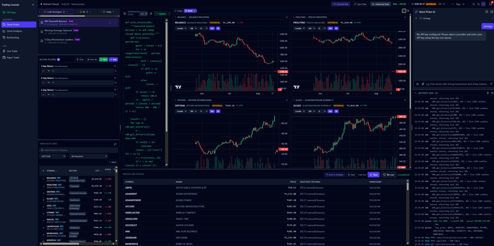

# TradeAI

### AI-Native Trading Intelligence, Strategy Automation & Execution

**TradeAI** is an AI-agent-driven trading platform designed to bring the
complete trading workflow into a single, natural-language-controlled
workspace.

Instead of switching between a stock screener, charting platform,
strategy editor, backtesting engine, paper-trading system, and broker
terminal, TradeAI provides a unified interface where users can
**discover stocks, analyze markets, create strategies, backtest ideas,
paper trade, and connect to live trading workflows through AI agents**.



------------------------------------------------------------------------

## Why TradeAI?

Traditional trading workflows are fragmented:

``` text
Stock Screener
      ↓
Charts / Technical Analysis
      ↓
Strategy Development
      ↓
Backtesting
      ↓
Paper Trading
      ↓
Live Trading
```

TradeAI aims to turn this into an **AI-orchestrated workflow**:

``` text
                 Natural Language
                       │
                       ▼
                ┌──────────────┐
                │  AI Trading  │
                │    Agent     │
                └──────┬───────┘
                       │
       ┌───────────────┼────────────────┐
       │               │                │
       ▼               ▼                ▼
  Stock Picker    Stock Analyzer    Backtesting
       │               │                │
       └───────────────┼────────────────┘
                       │
             ┌─────────┴─────────┐
             ▼                   ▼
       Paper Trading        Live Trading
             │                   │
             └─────────┬─────────┘
                       ▼
                 Broker / Market
                    Services
```

The goal is not simply to add a chatbot to a trading application. The AI
acts as an **orchestration layer** that can translate user intent into
data retrieval, analysis, strategy logic, and trading workflows.

------------------------------------------------------------------------

# Key Capabilities

## 🤖 AI-Agent Trading Interface

Interact with the platform using natural language rather than manually
configuring every operation.

Examples:

``` text
"Find NIFTY 500 stocks with strong 5-day momentum and increasing volume."

"Find stocks that are currently showing an RSI oversold bounce."

"Create a strategy using RSI and moving-average confirmation."

"Backtest this strategy over the last two years."

"Show me the stocks affected by today's news and compare them with
similar historical events."

"Analyze this stock and explain the technical setup."
```

The agent can interpret the request and coordinate the appropriate
platform capabilities.

------------------------------------------------------------------------

## 📊 Stock Picker

The **Stock Picker** provides an AI-assisted way to discover stocks from
a defined market universe.

Capabilities include:

-   Universe-based stock screening
-   Natural-language stock selection
-   Multi-condition filters
-   Momentum analysis
-   Return-based filters
-   RSI-based screening
-   Volume-aware screening
-   Strategy-driven stock discovery
-   Ranked result tables
-   Watchlist integration
-   Generated strategy/filter logic

A user can combine multiple conditions without having to manually build
every query from scratch.

Example:

``` text
Find NIFTY 500 stocks that:

• returned more than 3% over 5 days
• have positive short-term momentum
• show increasing volume
• are not extremely overbought
```

TradeAI can turn that intent into executable screening logic.

------------------------------------------------------------------------

# 📈 Stock Analyzer

The **Stock Analyzer** is designed for deeper investigation of
individual securities.

The AI can combine available market information with technical analysis
to help investigate:

-   Price action
-   Historical trends
-   Technical indicators
-   Volume behavior
-   Momentum
-   Support and resistance context
-   Historical price patterns
-   Relevant news and events
-   AI-generated analysis

Instead of only presenting raw numbers, the objective is to allow users
to ask questions about the market in a conversational way.

------------------------------------------------------------------------

# 🧠 AI Strategy Generation

TradeAI can convert natural-language strategy descriptions into
executable strategy logic.

For example:

``` text
Create a strategy that:

1. Buys when RSI falls below 30
2. Requires positive short-term momentum
3. Exits when RSI moves above 60
4. Uses historical data for validation
```

The platform can generate the corresponding strategy logic and expose
the generated code inside the interface.

This creates a transparent workflow:

``` text
Natural Language
       ↓
Strategy Interpretation
       ↓
Generated Strategy Logic
       ↓
Execution
       ↓
Results
```

The generated logic can be inspected instead of treating the AI as a
black box.

------------------------------------------------------------------------

# 🔬 Backtesting

The **Backtesting** workflow allows strategies to be evaluated against
historical market data before using them in a trading workflow.

Typical flow:

``` text
Strategy Idea
     ↓
AI-generated Strategy
     ↓
Historical Market Data
     ↓
Backtest
     ↓
Signals / Trades / Results
```

This allows users to iterate on ideas before moving toward paper or live
execution.

> Backtesting results are historical simulations and do not guarantee
> future performance.

------------------------------------------------------------------------

# 🧪 Paper Trading

TradeAI separates strategy experimentation from real-money execution
through **Paper Trading**.

The intended workflow is:

``` text
Strategy
   ↓
Backtest
   ↓
Paper Trade
   ↓
Observe behaviour
   ↓
Refine strategy
```

Paper trading can be used to validate how a strategy behaves in a
simulated environment before connecting it to live execution.

------------------------------------------------------------------------

# ⚡ Live Trading

TradeAI also provides a **Live Trade** workflow for connecting trading
operations with supported broker infrastructure.

The architecture is designed so that the same AI-driven workflow can
move from:

``` text
Analyze
  ↓
Generate Strategy
  ↓
Backtest
  ↓
Paper Trade
  ↓
Live Trade
```

Live trading should only be enabled after validating credentials,
strategy logic, risk controls, and execution behaviour.

**Never provide API credentials to an untrusted environment, and never
assume an AI-generated strategy is safe to execute without human
review.**

------------------------------------------------------------------------

# 📰 AI-Powered News & Event Intelligence

One of the key ideas behind TradeAI is combining **financial news with
historical market behaviour**.

A news event is not treated as an isolated headline.

The AI can be used to investigate:

``` text
Current News / Event
        ↓
Understand the event
        ↓
Identify potentially affected companies/sectors
        ↓
Search for similar historical events
        ↓
Analyze historical stock reactions
        ↓
Compare with the current market
        ↓
Surface relevant stocks and context
```

For example:

``` text
"Find stocks affected by this announcement
and show how similar announcements affected
those stocks historically."
```

This creates an **event → historical precedent → market reaction**
workflow.

The objective is to help users move beyond headline reading and
investigate how markets have behaved around comparable events.

------------------------------------------------------------------------

# 🔌 Bring Your Own LLM

TradeAI is designed around an LLM-provider-flexible architecture.

Users can connect their preferred AI provider using their own API
credentials rather than being locked into a single model provider.

This enables workflows such as:

``` text
TradeAI
   │
   ├── Cloud LLM Provider
   │
   ├── Another Compatible LLM Provider
   │
   └── Local LLM
          │
          ▼
        Ollama
```

This **Bring Your Own Model / Bring Your Own API Key** approach gives
users greater control over:

-   Model selection
-   Provider choice
-   API ownership
-   Cost management
-   Local inference options
-   Data-flow preferences

------------------------------------------------------------------------

# 🏠 Local AI with Ollama

TradeAI can also be used with **Ollama** for locally hosted models.

Start the Ollama service:

``` bash
ollama serve
```

Then configure the TradeAI AI provider/model settings to use the local
Ollama service.

A typical local architecture looks like:

``` text
┌───────────────────────────────┐
│          TradeAI              │
│                               │
│  Stock Picker                 │
│  Stock Analyzer               │
│  Backtesting                  │
│  Paper Trading                │
│  Live Trading                 │
└───────────────┬───────────────┘
                │
                ▼
         AI Agent Layer
                │
                ▼
             Ollama
                │
                ▼
          Local LLM Model
```

This makes it possible to experiment with local AI models without
requiring every inference request to be sent to a hosted LLM provider.

------------------------------------------------------------------------

# 🏗️ High-Level Architecture

``` text
                         ┌──────────────────────┐
                         │       User           │
                         │ Natural Language     │
                         └──────────┬───────────┘
                                    │
                                    ▼
                         ┌──────────────────────┐
                         │   AI Agent Layer     │
                         │                      │
                         │ Intent Understanding │
                         │ Tool Orchestration   │
                         │ Strategy Generation  │
                         │ Market Reasoning     │
                         └──────────┬───────────┘
                                    │
             ┌──────────────────────┼──────────────────────┐
             │                      │                      │
             ▼                      ▼                      ▼
      ┌─────────────┐       ┌──────────────┐       ┌──────────────┐
      │ Stock Picker│       │ Stock Analyzer│       │ Backtesting  │
      └──────┬──────┘       └──────┬───────┘       └──────┬───────┘
             │                     │                      │
             └─────────────────────┼──────────────────────┘
                                   │
                    ┌──────────────┴──────────────┐
                    │                             │
                    ▼                             ▼
             Market Data                    News / Events
                    │                             │
                    └──────────────┬──────────────┘
                                   │
                                   ▼
                         ┌──────────────────────┐
                         │ Trading Engine       │
                         └──────────┬───────────┘
                                    │
                         ┌──────────┴───────────┐
                         ▼                      ▼
                  Paper Trading           Live Trading
                                                │
                                                ▼
                                          Broker APIs
```

------------------------------------------------------------------------

# 🖥️ Interface

The TradeAI console brings multiple trading workflows into one
workspace.

### Main workspace

The interface includes areas for:

  -----------------------------------------------------------------------
  Area                                Purpose
  ----------------------------------- -----------------------------------
  **Stock Picker**                    Discover stocks using AI and
                                      configurable filters

  **Stock Analyzer**                  Investigate individual securities
                                      and market behaviour

  **Backtesting**                     Evaluate strategies against
                                      historical data

  **Paper Trade**                     Simulate trading without live
                                      capital

  **Live Trade**                      Connect validated workflows to live
                                      execution

  **Code Strategies**                 Inspect and work with generated
                                      strategy logic

  **Watchlist**                       Track selected securities

  **Charts**                          Visualize market price and volume
                                      data

  **Activity / Logs**                 Monitor system and trading activity

  **AI Interface**                    Control workflows using natural
                                      language
  -----------------------------------------------------------------------

------------------------------------------------------------------------

# 🧩 Technology Stack

TradeAI currently uses a modern web application architecture.

### Frontend

-   **React**
-   **TypeScript**
-   **Vite**
-   **Tailwind CSS**
-   **Lightweight Charts**
-   **React Router**
-   **Lucide React**
-   **React Resizable Panels**

### Backend

-   **Python**
-   **FastAPI**
-   **Uvicorn**
-   **SQLAlchemy**
-   **Pydantic**
-   **SQLite / aiosqlite**
-   **Python dotenv**
-   **Kite Connect integration**

### AI

-   Pluggable LLM/API architecture
-   User-provided API credentials
-   Local LLM support through **Ollama**

### Market & Trading

-   Historical market data
-   Real-time/live market workflows where configured
-   Broker connectivity
-   Strategy execution
-   Paper trading
-   Live trading

------------------------------------------------------------------------

# 🚀 Getting Started

## Prerequisites

Install:

-   Python 3.x
-   Node.js / npm
-   Git
-   Ollama --- optional, if using local AI

A broker API account/credentials may be required for broker-connected
trading workflows.

------------------------------------------------------------------------

## 1. Clone the repository

``` bash
git clone https://github.com/Brahma-S-P/TradeAI.git
cd TradeAI
```

------------------------------------------------------------------------

## 2. Set up the backend

``` bash
cd backend
```

Create a virtual environment:

### Windows

``` bash
python -m venv venv
venv\Scripts\activate
```

### Linux / macOS

``` bash
python3 -m venv venv
source venv/bin/activate
```

Install dependencies:

``` bash
pip install -r requirements.txt
```

Start the API server:

``` bash
uvicorn app.main:app --host 0.0.0.0 --port 8000 --reload
```

The backend will be available at:

``` text
http://localhost:8000
```

------------------------------------------------------------------------

## 3. Set up the frontend

Open another terminal:

``` bash
cd frontend
npm install
npm run dev -- --host
```

The frontend will normally be available at:

``` text
http://localhost:5173
```

------------------------------------------------------------------------

## 4. Windows startup script

The repository also contains:

``` text
start.bat
```

This can be used as a Windows convenience launcher after updating its
local backend/frontend paths if necessary.

------------------------------------------------------------------------

# 🔑 API & Provider Configuration

TradeAI is designed to work with externally supplied credentials for AI
and trading integrations.

Typical configuration areas include:

``` text
AI / LLM Provider
        │
        ├── API Key
        ├── Model
        └── Provider configuration

Trading / Broker
        │
        ├── API Key
        ├── API Secret / Token
        └── Session configuration

Market / News Data
        │
        └── Data-provider configuration
```

### Security recommendations

-   Never commit API keys to Git.
-   Never hard-code secrets into source files.
-   Use environment variables or the platform's credential
    configuration.
-   Rotate credentials if they are accidentally exposed.
-   Use paper trading while validating new strategies.
-   Review AI-generated code before execution.
-   Keep live trading credentials separate from development credentials.

------------------------------------------------------------------------

# 🧠 Example AI Workflows

## Stock discovery

``` text
Find NIFTY 500 stocks with:

- positive 5-day momentum
- increasing volume
- RSI below 40
- improving short-term price action
```

------------------------------------------------------------------------

## Technical analysis

``` text
Analyze RELIANCE.

Look at:

- recent trend
- RSI
- volume
- momentum
- historical support/resistance
- relevant recent news
```

------------------------------------------------------------------------

## Strategy creation

``` text
Create a mean-reversion strategy:

Buy when RSI < 30.
Require positive volume confirmation.
Exit when RSI > 60.
```

------------------------------------------------------------------------

## Backtesting

``` text
Backtest the strategy on historical data
and show the generated signals and results.
```

------------------------------------------------------------------------

## News intelligence

``` text
Find today's major news events affecting
Indian equities.

Identify potentially affected stocks and
compare their historical price behaviour
during similar events.
```

------------------------------------------------------------------------

## Paper trading

``` text
Run this strategy in paper trading
and track the resulting positions.
```

------------------------------------------------------------------------

# 🔄 End-to-End Trading Workflow

TradeAI is designed around an iterative research-to-execution lifecycle:

``` text
                    ┌───────────────┐
                    │   Discover    │
                    │    Stocks     │
                    └───────┬───────┘
                            │
                            ▼
                    ┌───────────────┐
                    │    Analyze    │
                    │ Market + News │
                    └───────┬───────┘
                            │
                            ▼
                    ┌───────────────┐
                    │    Create     │
                    │   Strategy    │
                    └───────┬───────┘
                            │
                            ▼
                    ┌───────────────┐
                    │   Backtest    │
                    └───────┬───────┘
                            │
                            ▼
                    ┌───────────────┐
                    │ Paper Trading │
                    └───────┬───────┘
                            │
                            ▼
                    ┌───────────────┐
                    │  Live Trade   │
                    └───────────────┘
```

At every stage, the user can interact with the system through natural
language.

------------------------------------------------------------------------

# 📁 Repository Structure

``` text
TradeAI/
│
├── backend/
│   ├── app/
│   ├── requirements.txt
│   └── ...
│
├── frontend/
│   ├── src/
│   ├── package.json
│   └── ...
│
├── docs/
│
├── main_page.png
├── nifty500_with_industry.json
├── start.bat
├── LICENSE
└── README.md
```

The repository is separated into frontend, backend, documentation,
market-universe data, and startup/configuration assets.

------------------------------------------------------------------------

# 🎯 Design Principles

### 1. Natural Language First

Users should be able to express trading intent without having to
translate every idea into technical filters manually.

### 2. Agentic Workflows

The AI should do more than answer questions. It should orchestrate the
tools and workflows required to complete a user's request.

### 3. Transparent AI

Generated strategy logic should be inspectable rather than completely
hidden from the user.

### 4. Model Flexibility

Users should be able to choose between supported hosted LLM providers
and local models through Ollama.

### 5. Research Before Execution

The platform supports an iterative workflow from discovery and analysis
through backtesting and paper trading before live execution.

### 6. Data-Driven Context

Market data, historical behaviour, technical indicators, and news can be
combined to provide richer trading context.

------------------------------------------------------------------------

# 🔮 Future Direction

Potential areas for extending TradeAI include:

-   Multi-agent trading research workflows
-   Advanced portfolio management
-   Risk-management agents
-   Strategy optimization
-   Walk-forward testing
-   Portfolio-level backtesting
-   Automated news-event extraction
-   Event-to-stock relationship graphs
-   Sentiment and entity extraction
-   Earnings-event analysis
-   Options analytics
-   More broker integrations
-   More market/data-provider integrations
-   Strategy versioning and experiment tracking
-   Agent execution approvals and guardrails
-   Advanced performance analytics
-   Scheduled autonomous research workflows

------------------------------------------------------------------------

# ⚠️ Risk & Disclaimer

TradeAI is a software and research project for market analysis, strategy
experimentation, and trading automation.

**It is not financial advice.**

Financial markets involve substantial risk. AI-generated analysis,
signals, strategies, historical patterns, and backtest results can be
incorrect, incomplete, or misleading. Historical performance does not
guarantee future results.

Before using any live-trading functionality:

-   Validate the strategy independently.
-   Review AI-generated code and decisions.
-   Test using historical data.
-   Use paper trading where appropriate.
-   Configure appropriate risk controls.
-   Verify broker/API permissions.
-   Monitor live execution.
-   Never expose trading credentials or secrets.

The user remains responsible for all trading decisions and execution.

------------------------------------------------------------------------

# 📜 License

This project is licensed under the **MIT License**.

See [`LICENSE`](LICENSE) for details.

------------------------------------------------------------------------

# 👨‍💻 Project

**TradeAI**\
AI-Native Trading Intelligence & Automation

Repository:

https://github.com/Brahma-S-P/TradeAI

------------------------------------------------------------------------

From market research to strategy execution — through natural
language.
From market research to strategy execution — through natural language.
